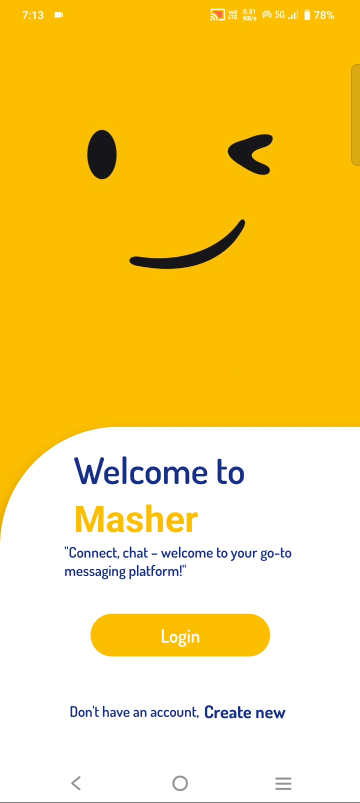
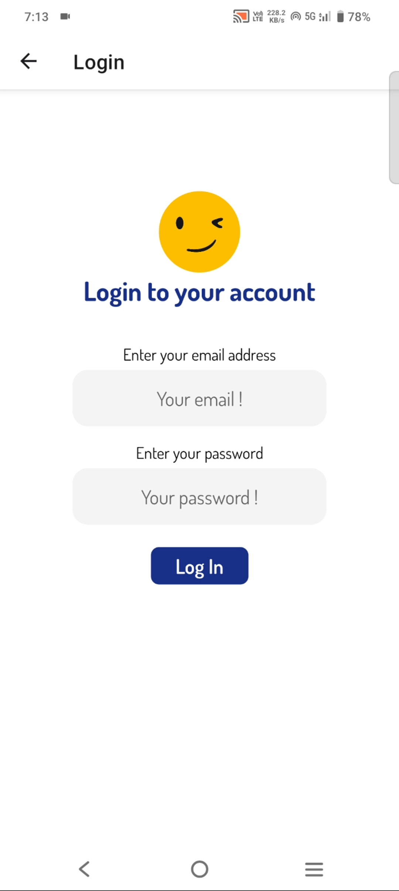

Hi. I am Krish Khare and I am developing mobile chat app application using react native, mongodb, socketio, redis, jwt etc

For this i am keeping backend separate for db server and chat server for scalability and code readability.

Some screeenshots and video giving below of my mobile chat app-

<!-- Send log in to access data from every route if user is not found (if necessary) to log out from app -->

issues-
navigation pages are reloading data when mounting but components are loading data each time they mounted

so i have to use redux to save data in state without loading the data again and again.

# Comment console.log because it reduces performance

First complete then optimize and break into smaller components and use redux when necessary

socket io with redis - A+
after deleting conversation, it is not coming when messaging next time - B
profile image uploading and loading and user data loading and updating - B
updating user data - C
notifications page - C
formik and error in create login and other inputs - C
resolve errors after login and signup - A
breaking into small components

Mongodb data directory is at # Where and how to store data.
storage:
  dbPath: C:\Program Files\MongoDB\Server\8.0\data

  i can change it

I am using mongodb as service

# first complete application then check all console.logs and other to check if something is running twice or not efficient

To set up Redis clustering on WSL (Windows Subsystem for Linux):

Install Redis on your WSL instance:

bash
Copy
Edit
sudo apt update
sudo apt install redis-server
Configure each Redis instance (e.g., redis-7000.conf, redis-7001.conf) with the following lines:

bash
Copy
Edit
port 7000
cluster-enabled yes
cluster-config-file nodes.conf
cluster-node-timeout 5000
Start each instance with:

bash
Copy
Edit
redis-server /path/to/redis-7000.conf
Create the cluster with:

bash
Copy
Edit
redis-cli --cluster create localhost:7000 localhost:7001 localhost:7002 --cluster-replicas 0

  // const ListFooter = useMemo(
  //   () =>
  //     loadingMessages ? (
  //       <ActivityIndicator
  //         style={{ margin: 15 }}
  //         size="small"
  //         color="#000000"
  //       />
  //     ) : null,
  //   [loadingMessages]
  // );

  //   return (
  //     <>
  //       <StatusBar backgroundColor={"#fdbe00"} barStyle={"light-content"} />

  //       {/* <View style={{ flex: 1, backgroundColor: "#fdbe00" }}> */}
  //       <Animated.View sharedTransitionTag="sharedTag" style={{ flex: 1, backgroundColor: "#fdbe00" }}>
  //         {isMessMenuVisible === false ? (
  //           <MessagingScreenCustomHeader
  //             userId={otherParticipantId}
  //             name={otherParticipantName}
  //             imageUrl={imageUrl}
  //           />
  //         ) : (
  //           <DeleteMessMenu
  //             selectedCount={selectedMessageIds.length}
  //             onDelete={() => setAskMessVisible(true)}
  //             onBack={() => handleHideMessageMenu()}
  //           />
  //         )}
  //         <Surface
  //           elevation={5}
  //           style={{
  //             backgroundColor: "white",
  //             borderTopLeftRadius: 40,
  //             borderTopRightRadius: 40,
  //             // marginTop: 62,
  //             overflow: "hidden",
  //             flex: 1,
  //           }}
  //         >
  //           {loadingMessages && messages.length === 0 && (
  //             <MessagingScreenMessagesLoader />
  //           )}
  //           <View style={styles.messagesContainer}>
  //             {loadingMessages && <MessagingScreenMessagesLoader />}

  //             <FlashList
  //               data={messages || []}
  //               removeClippedSubviews={true}
  //               keyboardShouldPersistTaps="handled"
  //               automaticallyAdjustKeyboardInsets={true}
  //               showsVerticalScrollIndicator={false}
  //               extraData={selectedMessageIds}
  //               inverted={true}
  //               // onEndReached={() =>
  //               //   !loadingMessages && fetchConversationMessages()
  //               // }
  //               ListEmptyComponent={<Text>No messages</Text>}
  //               ListFooterComponent={ListFooter}
  //               onEndReachedThreshold={0.5}
  //               renderItem={renderItem}
  //               estimatedItemSize={40}
  //               keyExtractor={(item) => item.messageId.toString()}
  //             />
  //           </View>
  //         </Surface>

  //         <View style={{ backgroundColor: "#FFFFFF"}}>
  //           <Surface
  //             elevation={5}
  //             style={{
  //               alignItems: "center",
  //               justifyContent: "center",
  //               backgroundColor: "white",
  //               width: "100%",
  //               borderTopLeftRadius: 20,
  //               borderTopRightRadius: 20,
  //               paddingTop: 1,
  //             }}
  //           >
  //             {/* {otherUserTyping && ( */}
  //               <Animated.View
  //                 style={{
  //                   flexDirection: "row",
  //                   justifyContent: "flex-start",
  //                   alignItems: "center",
  //                   width: "100%",
  //                   // padding: ,
  //                   height: TypingHeight,
  //                 }}
  //               >
  //                 <Text
  //                   style={{
  //                     color: "#193088",
  //                     fontSize: 14,
  //                     fontFamily: "Dosis_500Medium",
  //                     marginLeft: 15,
  //                   }}
  //                 >
  //                   @{otherUserTyping} is typing...
  //                 </Text>
  //               </Animated.View>
  //              {/* )}  */}

  //             <View
  //               style={{
  //                 flexDirection: "row",
  //                 alignItems: "center",
  //                 justifyContent: "space-evenly",
  //                 width: "100%",
  //               }}
  //             >
  //               <PressableIcon
  //                 iconName="multiTrackAudio"
  //                 iconSize={25}
  //                 rippleColor="gainsboro"
  //                 iconColor="#193088"
  //                 customStyle={{
  //                   backgroundColor: "whitesmoke",
  //                   padding: 12,
  //                   borderRadius: 50,
  //                 }}
  //                 onClick={() => {}}
  //                 disabled={false}
  //               />

  //               <View style={{ flexDirection: "row", alignItems: "center" }}>
  //                 <TextInput
  //                   style={styles.inputBar}
  //                   underlineStyle={{ display: "none" }}
  //                   value={text}
  //                   onChangeText={(text) => handleTyping(text)}
  //                   label={
  //                     <Text
  //                       style={{
  //                         color: "gray",
  //                         textAlign: "center",
  //                       }}
  //                     >
  //                       Your Message...
  //                     </Text>
  //                   }
  //                   placeholderTextColor={"gainsboro"}
  //                   outlineStyle={{
  //                     borderWidth: 0,
  //                     borderRadius: 25,
  //                     margin: 0,
  //                     padding: 0,
  //                   }}
  //                   mode="outlined"
  //                   cursorColor="royalblue"
  //                   right={
  //                     text === "" && (
  //                       <TextInput.Icon
  //                         icon={"microphone"}
  //                         color={"#193088"}
  //                         onPress={() => {
  //                           console.log("Speak. I will convert speech to text");
  //                         }}
  //                       />
  //                     )
  //                   }
  //                 />
  //               </View>
  //               <PressableIcon
  //                 iconName="smileO"
  //                 iconColor="#193088"
  //                 rippleColor="gainsboro"
  //                 iconSize={25}
  //                 customStyle={{
  //                   backgroundColor: "whitesmoke",
  //                   padding: 10,
  //                   borderTopRightRadius: 35,
  //                   borderBottomRightRadius: 35,
  //                 }}
  //                 onClick={() => {}}
  //                 disabled={false}
  //               />

  //               <PressableIcon
  //                 iconName="send"
  //                 iconColor="white"
  //                 rippleColor=""
  //                 iconSize={25}
  //                 customStyle={{
  //                   opacity: text === "" ? 0.8 : 1,
  //                   backgroundColor: "#193088",
  //                   padding: 10,
  //                   borderRadius: 100,
  //                 }}
  //                 onClick={sendMessage}
  //                 disabled={text === ""}
  //               />
  //             </View>

  //           </Surface>
  //         </View>
  //       </Animated.View>

  //       <Portal>
  //         <Dialog
  //           visible={askMessVisible}
  //           onDismiss={hideAskDeleteMessDialog}
  //           style={{ backgroundColor: "#FFFFFF", borderRadius: 20 }}
  //         >
  //           <View style={{ flexDirection: "row", justifyContent: "center" }}>
  //             <TabBarIcon name="delete" color="#000000" size={30} />
  //           </View>

  //           <Dialog.Title
  //             style={{
  //               fontFamily: "Dosis_700Bold",
  //               color: "#000000",
  //               textAlign: "center",
  //             }}
  //           >
  //             Delete Message
  //           </Dialog.Title>
  //           <Dialog.Content>
  //             <Text
  //               style={{
  //                 fontFamily: "Dosis_400Regular",
  //                 color: "#000000",
  //                 textAlign: "center",
  //                 fontSize: 17,
  //               }}
  //             >
  //               Are you sure!.
  //             </Text>
  //             <Text
  //               style={{
  //                 fontFamily: "Dosis_400Regular",
  //                 color: "#000000",
  //                 textAlign: "center",
  //                 fontSize: 17,
  //               }}
  //             >
  //               {selectedMessageIds.length > 1
  //                 ? "These messages"
  //                 : "This message"}{" "}
  //               will be deleted permanently...
  //             </Text>
  //           </Dialog.Content>
  //           <Dialog.Actions>
  //             <Button
  //               style={{ backgroundColor: "white", borderRadius: 10 }}
  //               onPress={() => {
  //                 console.log("Cancel");
  //                 setAskMessVisible(false);
  //                 handleHideMessageMenu();
  //               }}
  //             >
  //               <Text style={{ color: "#000000" }}>Cancel</Text>
  //             </Button>
  //             <Button
  //               style={{ backgroundColor: "red", borderRadius: 10 }}
  //               onPress={deleteMessage}
  //             >
  //               <Text style={{ color: "#FFFFFF" }}>Unsend!</Text>
  //             </Button>
  //           </Dialog.Actions>
  //         </Dialog>
  //       </Portal>
  //     </>
  //   );
  // }

  {
  "name": "my-app",
  "version": "1.0.0",
  "main": "index.ts",
  "scripts": {
    "start": "expo start",
    "android": "expo run:android",
    "ios": "expo run:ios",
    "web": "expo start --web"
  },
  "dependencies": {
    "@expo-google-fonts/dosis": "^0.2.3",
    "@gorhom/bottom-sheet": "^5.1.1",
    "@react-native-community/netinfo": "11.4.1",
    "@react-navigation/bottom-tabs": "^7.2.0",
    "@react-navigation/drawer": "^7.1.1",
    "@react-navigation/native": "^7.0.14",
    "@react-navigation/native-stack": "^7.2.0",
    "@react-navigation/stack": "^7.1.1",
    "@realm/react": "^0.11.0",
    "@reduxjs/toolkit": "^2.6.0",
    "@shopify/flash-list": "1.7.3",
    "@types/socket.io-client": "^1.4.36",
    "axios": "^1.8.1",
    "expo": "^52.0.37",
    "expo-dev-client": "~5.0.12",
    "expo-file-system": "~18.0.11",
    "expo-font": "^13.0.4",
    "expo-image-picker": "^16.0.6",
    "expo-media-library": "~17.0.6",
    "expo-navigation-bar": "^4.0.8",
    "expo-optimize": "^0.2.20",
    "expo-secure-store": "^14.0.1",
    "expo-system-ui": "~4.0.8",
    "formik": "^2.4.6",
    "react": "18.3.1",
    "react-content-loader": "^7.0.2",
    "react-native": "0.76.7",
    "react-native-gesture-handler": "~2.20.2",
    "react-native-otp-textinput": "^1.1.6",
    "react-native-paper": "^5.13.1",
    "react-native-reanimated": "~3.16.1",
    "react-native-safe-area-context": "^5.2.0",
    "react-native-screens": "^4.9.1",
    "react-native-svg": "^15.11.2",
    "react-native-vector-icons": "^10.2.0",
    "react-redux": "^9.2.0",
    "realm": "^20.1.0",
    "redux": "^5.0.1",
    "socket.io-client": "^4.8.1",
    "yup": "^1.6.1"
  },
  "devDependencies": {
    "@babel/core": "^7.25.2",
    "@types/react": "~18.3.12",
    "typescript": "^5.3.3"
  },
  "private": true
}

# WatermelonDB uses snake_case in the schema but camelCase in the model class.

Redux is better than context and more scalable for large applications

While fetching chats, i am storing other participants in db is its not a group. Because for group fetching data will be very much which will increase bandwidth and complexity. 
<!-- So i will update data when user opens group, the group conversation data will be updated and participants will be added if not else updated -->